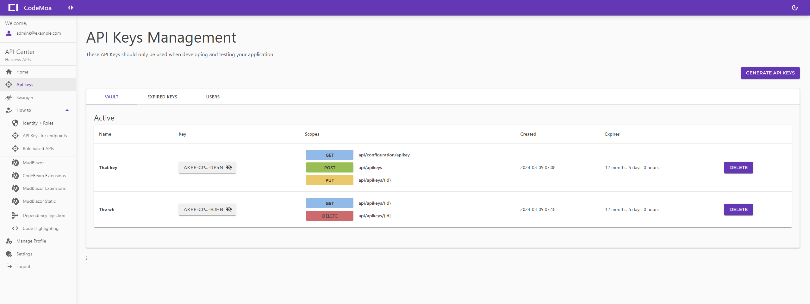

# MudRoles

    

This project includes an API management interface.



## Overview
MMudRoles is a sample project demonstrating the use of Blazor with Identity and roles, integrated with MudBlazor for UI components.
This project includes a Web API protected by role-based authorization and showcases how to access APIs based on roles. 
It also features API key management, rate limiting, and user secrets for secure configuration.
The application includes dedicated pages explaining various setups:

- **Home**: Overview of the application.
- **Authentication**: User registration and login.
- **Blazor Identity**: Integration of Blazor with ASP.NET Core Identity.
- **Role Management**: Assigning and managing user roles.
- **Role-Based APIs**: Roles implementation explained in APIs.
- **API Key Management**: Generating and managing API keys.
- **API Keys for Endpoints**: Managing API keys for specific endpoints.
- **API Management**: Comprehensive API management interface.
- **Rate Limiting**: Explanation and configuration of rate limiting.
- **User Secrets**: Securely managing sensitive configuration data.
- **Endpoint Examples**: Endpoint with all HTTP verbs and their explanations.
- **Dependency Injection**: Explanation of dependency injection in the project.
- **Code Beam Extensions**: Describing the usage of code beam extensions in the project.
- **MudBlazor Components**: Overview of MudBlazor components used in the project.
- **Working with MudBlazor**: MudBlazor extensions and their usage.
- **MudBlazor Static Controls**: Static controls for account pages.
- **Code Highlighting**: Code highlighting with Highlight.js.
- **Dashboard**: Overview of user activities and statistics.
- **User Profile**: Managing user profile information.
- **Settings**: Application settings and configurations.

## Features
- **Blazor Server**: Interactive web UI with Blazor.
- **MudBlazor**: Modern UI components for Blazor.
- **ASP.NET Core Identity**: User authentication and role management.
- **Role-Based Authorization**: Admin and User roles with specific access permissions.
- **Web API**: Protected endpoints with role-based filtering, API keys and Rate-Limiting.

## Prerequisites
- [.NET 8 SDK](https://dotnet.microsoft.com/download/dotnet/8.0)
- [Visual Studio 2022](https://visualstudio.microsoft.com/vs/) or later with ASP.NET and web development workload.

## Getting Started

### Installation
1. **Clone the repository**:

```
git clone https://github.com/LogneBudo/MudRoles.git
cd MudRoles
```

2. **Restore NuGet packages**:

```
dotnet restore
```

3. **Update the database**:

Api key database setup:

```
dotnet ef database update --context ApiKeyDbContext
```

Application database setup:

```
dotnet ef database update --context ApplicationDbContext
```

**If you use the Package Manager Console**:

```
Update-Database -Context ApiKeyDbContext
Update-Database -Context ApplicationDbContext
```

### Configuration
1. **AppSettings**: Ensure your `appsettings.json` is configured correctly for your database and authentication settings.

### Running the Application
1. **Run the application**:

```
dotnet run
```

2. **Open in browser**: Navigate to `https://localhost:[YourPortNumber]` to see the application in action.

## Project Structure
- **Client**: Blazor Server application with MudBlazor components.
- **Server**: ASP.NET Core Web API with Identity and role-based authorization.
- **Shared**: Shared models and services between Client and Server.

## Roles and Authorization
- **Admin Role**: Full access to all resources and administrative functionalities.
- **User Role**: Limited access to user-specific resources.

### Default Roles
Upon registration, new users are automatically assigned the "User" role. The "Admin" role must be assigned manually.

## Useful Links
- [MudBlazor Documentation](https://mudblazor.com/)
- [ASP.NET Core Identity](https://docs.microsoft.com/en-us/aspnet/core/security/authentication/identity)
- [Blazor Documentation](https://docs.microsoft.com/en-us/aspnet/core/blazor/)
- [Entity Framework Core](https://docs.microsoft.com/en-us/ef/core/)

### Additional Resources
- [Blazor Identity UI (Individual Accounts)](https://learn.microsoft.com/en-us/aspnet/core/blazor/security/server/?view=aspnetcore-8.0&tabs=visual-studio#blazor-identity-ui-individual-accounts)
- [First Web API Tutorial](https://learn.microsoft.com/en-us/aspnet/core/tutorials/first-web-api?view=aspnetcore-8.0&tabs=visual-studio)
- [Blazor Forms and Validation](https://learn.microsoft.com/en-us/aspnet/core/blazor/forms/validation?view=aspnetcore-8.0)
- [Account Confirmation and Password Recovery](https://learn.microsoft.com/en-us/aspnet/core/blazor/security/server/account-confirmation-and-password-recovery?view=aspnetcore-8.0)


## Contributing
Contributions are welcome! Please open an issue or submit a pull request.

## License
This project is licensed under the MIT License. See the [LICENSE](LICENSE) file for details.

## Contact
For any questions or feedback, please contact [Djovani](mailto:anupjitamang@gmail.com).

